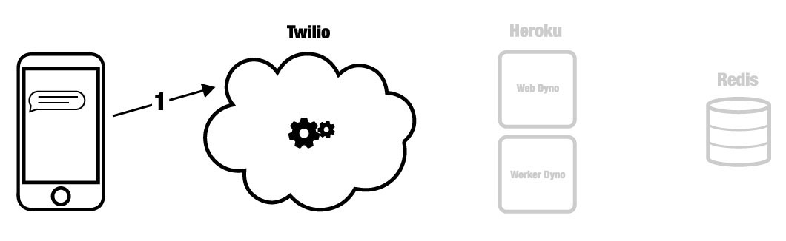

Application Landscape
=====================

Major Components
----------------
Four major components are part of the pyrowire application landscape:

    * a mobile phone
    * Twilio service
    * Heroku web/worker dynos
    * Redis instance (local, RedisCloud, RedisToGo)

.. image:: ../_static/images/components.jpg

Distinct Events
---------------
The following seven distinct events describe most of what pyrowire is doing. For any further clarification needs, consult the source code.

1. An SMS is sent to a Twilio number or shortcode
~~~~~~~~~~~~~~~~~~~~~~~~~~~~~~~~~~~~~~~~~~~~~~~~~

During this phase, Twilio's service receives an SMS or MMS message at some phone number or shortcode that you have defined
as pointing at your application endpoint. Twilio constructs a TwiML payload and forwards it to your application in Heroku.

2. Your application's web dyno receives the TwiML message
~~~~~~~~~~~~~~~~~~~~~~~~~~~~~~~~~~~~~~~~~~~~~~~~~~~~~~~~~

.. image:: ../_static/images/events_2.jpg

When your application receives a TwiML message, the message is restructured into a python dict containing all of the
necessary properties to be handled by pyrowire. The message is then run through the validators defined for your topic in
your settings.py file. If the message passes all validators, it is queued in Redis for a worker to pick up.

3. Queueing the message for your worker(s)
~~~~~~~~~~~~~~~~~~~~~~~~~~~~~~~~~~~~~~~~~~
.. image:: ../_static/images/events_3.jpg

Once validated, messages are queued in Redis for retrieval by your workers. Workers will only ever dequeue messages that
are assigned to their respective topic.

4. Handling messages
~~~~~~~~~~~~~~~~~~~~

.. image:: ../_static/images/events_4.jpg

This event is where the meat of the application resides. In this event, your worker dyno(s) will pop items off of their
topic's queue, and do whatever you have defined should happen for the messages' respective topic. For instance, you may
 take the noun word parts out of the message and return the first image retrieved by a google image search on those words.
 Once your message handler has finished its work, it will typically sending the message back.

5. Sending back TwiML
~~~~~~~~~~~~~~~~~~~~~

.. image:: ../_static/images/events_5.jpg

pyrowire has built-in handlers for sending SMS and MMS messages, and it does so by constructing a TwiML message object via
the Twilio REST API.

6. Message Received
~~~~~~~~~~~~~~~~~~~

.. image:: ../_static/images/events_6.jpg

Once Twilio gets your outbound response message, it will forward it back to the original sender, using the mobile number
attached to the original message.

7. Recording the Message
~~~~~~~~~~~~~~~~~~~~~~~~

.. image:: ../_static/images/events_7.jpg

Once the message has been validated, handled, and sent back, your worker dyno will record the completed event in Redis,
as a backup record of what took place.