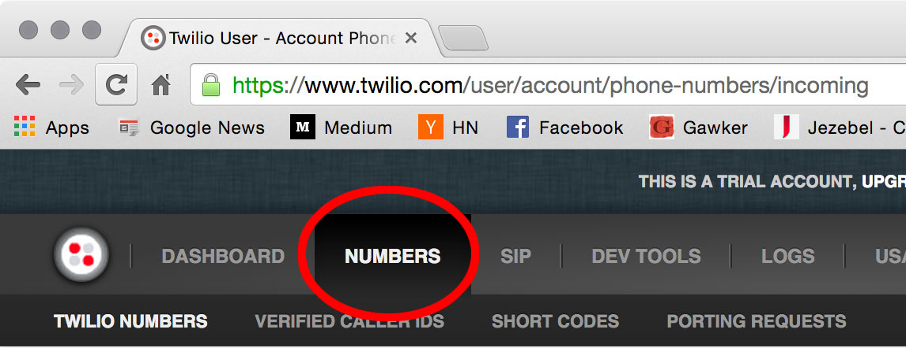

Tutorial
========

Yo Momma
--------
For our sample application, we are going to make an SMS application that sends a random 'yo momma' joke to the person
who sends the initial text, because there is no excuse to not have a 'yo momma' joke handy.

The application parameters:
    * Text 'yo momma' to some number
    * Receive a 'yo momma' joke back.
    * No profanity validation required
    * Inbound message must say 'yo momma' at some point

Installation
------------
Firstly, let's install pyrowire in a *virtualenv*.
::

    $ cd ~/src
    $ mkdir yo_mamma
    $ *virtualenv* yo_mamma
    $ cd yo_mamma && source bin/activate
    $ *pip* install pyrowire

Generating Stub Files
---------------------
Now that we have pyrowire installed, let's create the stub files.
::

    $ pyrowire --init

We now have our stub files all set in the root of our project folder. Let's take a look at the raw sample app file:

.. code:: python

    import pyrowire
    import settings

    # configure the pyrowire application
    pyrowire.configure(settings)

    # all app.processor methods need to be annotated with the topic for which they process
    # and take one kwarg, 'message_data'
    @pyrowire.handler(topic='my_topic')
    def my_processor(message_data):
        if not message_data:
            raise TypeError("message_data must not be None")
        # insert handler logic here
        return message_data

    # all pyro.filter methods need to be annotated with the name of the filter
    # and take one kwarg, 'message_data'
    @pyrowire.validator(name='my_validator')
    def my_filter(message_data):
        if not message_data:
            raise TypeError("message_data must not be None")
        # insert validation logic here
        # validators should try to prove that the message is invalid, i.e., return True
        return True

    if __name__ == '__main__':
        pyrowire.run()

Defining the Handler
--------------------

We want to zero in on the handler, since that is where we are going to get our joke to send back to the texter. Let's look
at how we could implement this:

.. code:: python

    @pyrowire.handler(topic='yo_momma')
    def yo_momma_handler(message_data):
        if not message_data:
            raise TypeError("message_data must not be None")

        import urllib2
        import json

        resp = urllib2.urlopen('http://api.yomomma.info').read()
        content = resp.split('<body>')[1].split('</body>')[0].strip()

        message_data['reply'] = json.loads(content)['joke']
        pyrowire.sms(message_data=message_data)

        return message_data

And that's it. The handler does a very simple thing; it fetches a response from api.yomomma.info, parses out the returned
joke, attaches it to the original message_data object, then returns it as an SMS to the sender.

At this point, if you wanted to run the application without any additional validation, you would be good to go.

Adding a Validator
------------------
Since we initially said the sender should text 'yo momma' to our application number, we should make sure that the message
received says 'yo momma' and nothing else. Let's add a custom validator.

.. code:: python

    @pyrowire.validator(name='yo_momma')
    def yo_momma_validator(message_data):
        if not message_data:
            raise TypeError("message_data must not be None")

        return not 'yo momma' == message_data['message'].lower().strip()

Hmm...this will work, but, maybe it's too harsh. Let's back it up so that our custom validator just checks
to ensure that the phrase 'yo momma' is in the text body.

.. code:: python

    @pyrowire.validator(name='yo_momma')
    def yo_momma_validator(message_data):
        if not message_data:
            raise TypeError("message_data must not be None")

        import re
        return not re.search(r'\byo momma\b', message_data['message'].lower().strip())

Yeah, that's nice. Let's go with that.

Overriding a Default Validator
------------------------------
If you want, you can override a default validator simply by redefining it in your application file. For example, pyrowire
comes with a profanity validator to ensure that incoming text messages aren't profane. This runs by default, but for the
yo momma app, we are going to disable it.

.. code:: python

    # custom handler and validator here

    @pyrowire.validator(name='profanity')
    def override_profanity(message_data=None):
        pass

This is somewhat of a trivial example, since if we want to disable a validator, we only need to remove it from the topic
validator dictionary in our settings file. Since we haven't covered settings yet, however, this example stands to illustrate
that you can override default validators.

Settings
--------
Sweet, we are almost ready to run this sucker and start dropping momma jokes on people. We will need to dial in our
settings file though, so it knows what to do when a message with the topic 'yo_momma' is received. To do that, we open
the ``settings.py`` file that we stubbed out earlier.

.. code:: python

    import logging

    TOPICS = {
        'my_topic': {
            'send_on_accept': False,
            'accept_response': 'Great, we\'ll get right back to you.',
            'error_response': 'It seems like an error has occurred...please try again later.',
            'validators': {
                'profanity': 'You kiss your mother with that mouth? No profanity, please.',
                'length': 'Your message exceeded the maximum allowable character limit (or was empty). Please try again .',
                'parseable': 'Please only use alphanumeric and punctuation characters.'
            },
            'properties': {},
            'twilio': {
                'account_sid': '',
                'auth_token': '',
                'from_number': '+1234567890'
            },
            'max_message_length': 160
        }
    }

    PROFILES = {
        'dev': {
            'debug': True,
            'log_level': logging.DEBUG,
            'redis': {
                'host': 'localhost',
                'port': 6379,
                'db': 0,
                'password': ''
            },
            'host': 'localhost',
            'port': 62023
        },
        'staging': {
            'debug': True,
            'log_level': logging.WARN,
            'redis': {
                'host': 'localhost',
                'port': 6379,
                'db': 0,
                'password': ''
            },
            'host': '0.0.0.0',
            'port': 0
        },
        'prod': {
            'debug': False,
            'log_level': logging.ERROR,
            'redis': {
                'host': 'localhost',
                'port': 6379,
                'db': 0,
                'password': ''
            },
            'host': '0.0.0.0',
            'port': 0
        }
    }

Ooh, looks like it's still got all the default settings, which is good.
Let's update the ``TOPICS`` section so it works for our application:

.. code:: python

    import logging

    TOPICS = {
        'yo_momma': {
            'send_on_accept': False,
            'accept_response': 'Yo momma is so fat...',
            'error_response': 'It seems like an error has occurred...please try again later.',
            'validators': {
                # removed the profanity validator, since we don't want to use it.
                'length': 'Your message exceeded the maximum allowable character limit (or was empty). Please try again .',
                'parseable': 'Please only use alphanumeric and punctuation characters.'
            },
            'properties': {},
            'twilio': {
                'account_sid': '<MY_TWILIO_ACCOUNT_SID>',
                'auth_token': '<MY_TWILIO_AUTH_TOKEN>',
                # update with your real number
                'from_number': '+1234567890'
            },
            'max_message_length': 160
        }
    }

What changed?

    * the name of the topic dict object
    * the ``accept_response`` definition
    * we removed ``profanity`` from the list of validators for 'yo_momma'
    * we added Twilio information (this step is rather crucial)

Cool, now that we've got our topic defined, we can move on to getting our profile/host settings dialed in, which incidentally,
should be already done for our dev environment.

At this point you can also go back to your app file and remove the override on the profanity validator. Because we just
removed it from the 'yo_momma' topic dictionary's 'validators' sub-dictionary, it won't apply to your incoming messages.

Host Settings
-------------
The other part of our settings file are the Profile/Host settings. Since we are still working locally, let's just worry
about the 'dev' settings for right now (we'll get to the staging/production settings in a bit):

.. code:: python

    # TOPICS defs up here

    PROFILES = {
        'dev': {
            'debug': True,
            'log_level': logging.DEBUG,
            'redis': {
                'host': 'localhost',
                'port': 6379,
                'db': 0,
                'password': ''
            },
            'host': 'localhost',
            'port': 62023
        },
        # staging, prod settings below
    }

This should all look pretty straightforward. We are developing locally using the port 62023,
with a local, password-less, Redis instance, and have debugging flags set to log at a debug level.

Running Locally
---------------
Checklist:
    * handler set up. Check.
    * validator set up. Check.
    * profanity filter disabled. Check.
    * topic and profile settings in. Check.

Awesome, it's time to run this sucker. Yo momma is about to get rained on.

To run this app, navigate to the root of your project directory, and make sure your virtual environment is active.
Next, run:

::

    $ ENV=DEV python app.py

Note that you need to include the ENV environment var so pyrowire knows which profile to choose. Running the above command
will spin up a web application on port 62023, and will spin up one worker per topic defined in your settings file (in the
case of this tutorial, it should spin up one worker).

In this example, we've omitted the ``RUN=(web|worker)`` environment variable, which causes both the web and worker
processes to run at the same time. When we move to Heroku, or some other platform like AWS, we will add the RUN variable
so we can separate the work across nodes. We will cover running as web or worker in the Heroku section below.

Sending a Test Message
----------------------
We need to send three parameters to our endpoint, since we are emulating an actual Twilio message:

    * **From**: the phone number from which the message was sent
    * **Body**: the message body
    * **MessageSid**: A unique 34-character string identifying the message resource

Cool, now pop open another terminal, and run the following, substituting your number for the ``From`` value:

::

    curl -X GET http://127.0.0.1:62023/queue/yo_momma&From=+1234567890&Body=yo%20momma&MessageSid=testsid

You should eventually see a returned message payload come through, and, if everything was set up correctly, your phone
should have received a text message in the form of a yo momma joke.

Deploying to Heroku
-------------------
pyrowire makes deploying to heroku super easy with a fabric walkthrough. To get started deploying this application, just run:

::

    $ pyrowire --deploy-heroku

This will walk you through logging into your Heroku account, if you haven't already, setting up an app, if you haven't already,
and adding Redis as an addon, if you haven't already. It will take you all the way to the point where you will just need to
add any changes to git, commit, and push to Heroku.

Configuring Twilio
------------------
Once you've got your Heroku application set up, you will want to head back over to your Twilio account to set up the endpoint.
This is fairly easy:

1. Navigate to your `Twilio account page <https://www.twilio.com/user/account/>`_ then click the 'Numbers' link in the nav bar.

2. Click on the phone number you want to set up.
3. Add the endpoint to your Heroku app, with the queue and topic name in the URL:

.. image:: ../_static/images/test_url.jpg

Bombs Away
----------
So now you have your Twilio endpoint set up, your application is running in Heroku, and you are ready to drop some
bombs on people's moms.